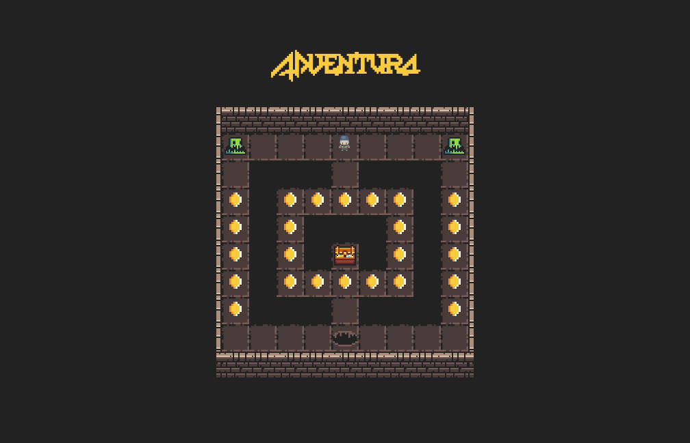

<h1 align="center">so_long [repo in progress]</h1>
<p align="center">
	<b>In this project, I created a 2D game from scratch using the minilibx library</b>
</p>




Find more informations about the project requirements [here](./documentation/project_requirements.pdf).

## About the game <a name="about"></a>

Write a program that checks whether a given map is valid, me

The program must be able to read a given map, check if all elements of the map are valid*, display all sprites on a window, and be able to move the player and collect items before exiting the game.

The projects demends that we create a game based on a given map that follows certain rues:
- the map must be stored in a file with <code>.ber</code> extension
- the map can only contain these characters 1 (wall), 0 (empty space), C (collectible), P (starting position), E (exit).
- the map must be rectangular, surrounded by walls and have at least one collectible (C), starting position (P) and exit (E)
- there must be a valid path leading to the exit.

The game must be able to use any map that follows those rules.

Here is what a valid map looks like.

```bash
11111111111
10000E00001
11110001111
1C1110111C1
1C0000000C1
1C000P000C1
11111111111
```

## Assets

## How it works

### 📍 Path finding
Since the game's foundation is the map, it's the first thing I implemented.

To be able to navigate the map easier, I store it in a matrix. This way, every element of the map will have a coordinate that is easy to access.

First by reading the content of the .ber file. 

I wrote the function ft_split_fd() which combines the get_next_line() and ft_split() functions. It allows me to read a file, save all its content then break it into substring I can store in my matrix.

```C
// game is a pointer to a structure that contains most variables of my game
int	map_checker(t_game *game)
{
	game->map = ft_split_fd(<path-to-mapfile>, <seperator>);
	if (!game->map)
		return (0);
}
```

For the map to be valid, I needed to check whether a viable path to the exit was present.
To do so, I opted for a graph algorithm: breath-first search. I chose it because it's implementation straight forward and since I only cared about 
### 🎥 Rendering
Rendering is displaying things on the screen. The basic idea of rendering in games is	 having a "game loop" within which you render your graphics a certain number of frames per second. More simply it consists of having an infinite loop, to only stops when you exit the game. At every turn of the loop, you update the state of your objects (ex: player position) than you render your graphics on the window with their updated states. 
```C
while ( gameIsRunning ) {
	processInput();
	updateObjects();
	render();
}

```
#### The map
#### The animated objects

### 🧩 Potential Improvements
1. better maps, 5-10 well designed maps for nice gameplay
2. more animation states: idle, walking, attack, dying (4x : UP, DOWN, LEFT, RIGHT).
3. add dashboard and menu 
4. wall collision, player can move between tiles instead of jumping from one to another
5. enemy patrol, patrol in random directions and attack when the player is close
6. try [flood-fill](https://en.wikipedia.org/wiki/Flood_fill) algorithm. better for inaccessible coins
7. graphical library and language, change from using C and the minilibx library to using C++ and SDL for easier development and betetr portability
8. create Docker image of the game, so that it can easily run on any system
9. play background music ([afplay](https://ss64.com/osx/afplay.html), [FMOD](https://stackoverflow.com/questions/428884/how-to-play-mp3-files-in-c) or [SDL_mixer](https://lazyfoo.net/tutorials/SDL/21_sound_effects_and_music/index.php))

## Useful Links
- [Game programming patters: State](https://gameprogrammingpatterns.com/state.html)
- [Making A Game #1: Making The Game Loop : C++ And SDL2 Tutorial](https://youtu.be/44tO977slsU)
